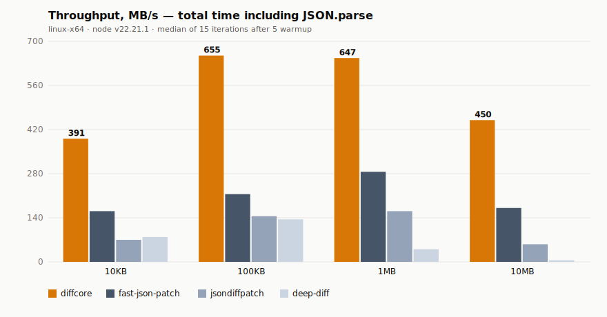

# diffcore benchmarks

Reproducible head-to-head numbers for [diffcore](https://www.npmjs.com/package/diffcore) against the three most-installed JSON-diff libraries on npm: [`fast-json-patch`](https://www.npmjs.com/package/fast-json-patch), [`jsondiffpatch`](https://www.npmjs.com/package/jsondiffpatch), and [`deep-diff`](https://www.npmjs.com/package/deep-diff).

This is the receipts file. Every comparison-page claim, blog post, and launch thread should link back here.

## TL;DR

On a single deep mutation across payloads from 10 KB to 10 MB:

| Payload | diffcore (total) | fast-json-patch | jsondiffpatch | deep-diff |
|--------:|-----------------:|----------------:|--------------:|----------:|
|   10 KB |  **0.05 ms** · 391 MB/s |  0.12 ms · 161 MB/s |  0.28 ms ·  70 MB/s |   0.25 ms ·  79 MB/s |
|  100 KB |  **0.30 ms** · 655 MB/s |  0.91 ms · 215 MB/s |  1.35 ms · 145 MB/s |   1.44 ms · 135 MB/s |
|    1 MB |  **3.02 ms** · 647 MB/s |  6.84 ms · 286 MB/s | 12.11 ms · 161 MB/s |  48.26 ms ·  40 MB/s |
|   10 MB | **43.41 ms** · 450 MB/s | 114.55 ms · 171 MB/s | 347.07 ms · 56 MB/s | 4140.55 ms · 5 MB/s |

Speedup vs the next-fastest library (`fast-json-patch`): **2.27× – 3.04×** total time across all sizes.

Speedup vs `jsondiffpatch` and `deep-diff` is much larger and grows with payload size.



## Methodology

- **Machine of record for the table above:** linux-x64, node v22.21.1.
- **Iterations:** median of 15 runs per cell, after 5 warmup runs.
- **Fixture:** deterministic seeded generator (`mulberry32`, seed = 42). Same seed → same payload on any machine.
- **Mutation:** single deep change — set `.v = 0` on the last record. Mirrors the common "one field changed" production case.
- **Timing:** `performance.now()` deltas. Total time includes `JSON.parse(left) + JSON.parse(right) + diff`. diffcore parses bytes inside WASM in a single pass, so its "total" is one call; the JS libraries pay an explicit `JSON.parse` cost.

## Reproduce

```bash
git clone https://github.com/DibbayajyotiRoy/rust-wasm-Library
cd rust-wasm-Library
npm install
npm install --no-save fast-json-patch deep-diff jsondiffpatch
npm run build:wasm
node bench/competitors.mjs
node bench/chart.mjs
```

Results land in `bench/results/competitors.json` and `bench/results/throughput.svg`.

## Diff-only (already-parsed objects)

For workloads where you already hold parsed JS objects in memory and just want the delta, the picture is more nuanced — diffcore's win is largest on the parse-fused path. Median ms per call:

| Payload | fast-json-patch (diff only) | jsondiffpatch (diff only) | deep-diff (diff only) |
|--------:|----------------------------:|--------------------------:|----------------------:|
|   10 KB |    0.04 ms |    0.11 ms |    0.23 ms |
|  100 KB |    0.15 ms |    0.55 ms |    0.85 ms |
|    1 MB |    2.99 ms |    6.89 ms |   40.97 ms |
|   10 MB |   27.83 ms |  211.75 ms | 4905.72 ms |

`fast-json-patch` is competitive in the diff-only mode at small sizes — it is a well-engineered pure-JS library and on a 10 KB pre-parsed object the JS engine is genuinely fast. diffcore's structural advantage shows up when (a) inputs arrive as bytes (very common: HTTP, files, queues, IPC) so the parse step is unavoidable, or (b) payloads are large enough that the constant-factor wins of a tight Rust inner loop dominate.

If your workload looks like "I already have two large objects in memory and need the delta," benchmark on your own data before switching. If your workload looks like "I have JSON bytes coming off the wire and need a patch," diffcore is the obvious pick.

## Output format compatibility

Throughput numbers are not the only axis. Output format determines whether your patches are interoperable with the rest of the ecosystem (servers, replay tools, audit logs).

| Library          | Path format            | Patch format            | Interop |
|------------------|------------------------|-------------------------|---------|
| diffcore         | RFC 6901 JSON Pointer  | RFC 6902 JSON Patch via `toJsonPatch()` | yes — drop-in for any RFC 6902 consumer |
| fast-json-patch  | RFC 6901 JSON Pointer  | RFC 6902 JSON Patch (native) | yes |
| jsondiffpatch    | Custom path strings    | Custom delta format     | no — requires its own apply |
| deep-diff        | Custom array path      | Custom kind notation    | no — requires its own apply |

`fast-json-patch` and diffcore are the only two libraries in this set that emit the IETF standard. If RFC 6902 compliance matters to your stack, those are the two real options, and the throughput table above is the relevant comparison.

## Caveats and what this benchmark does not measure

Be honest with yourself before quoting these numbers:

- **One mutation pattern.** A single deep change is one shape of workload. A diff that mutates 50% of keys, reorders an array, or replaces a deeply nested subtree will move the numbers — sometimes a lot. PRs adding more mutation patterns are welcome.
- **One machine.** The headline numbers are from one Linux x64 box. Your laptop, a CI runner, and a Cloudflare Worker will all produce different absolute numbers. Speedup ratios are usually more stable than absolute throughput.
- **Cold start not measured.** WASM instantiation is one-time; this benchmark amortizes it over the run. A serverless cold-start with a one-shot diff has different economics — diffcore's WASM module is ~95 KB gzipped and instantiates in single-digit ms on V8.
- **Patch size and quality.** Two patches that "describe the same change" can differ in size and shape. None of this is measured here yet.
- **Memory.** Peak RSS during a 10 MB diff is not measured. `deep-diff` in particular allocates very heavily; if you're memory-constrained that matters as much as time.

## Files

- `competitors.mjs` — the head-to-head runner.
- `fixtures.mjs` — deterministic seeded payload generator.
- `chart.mjs` — renders `results/throughput.svg` from `results/competitors.json`.
- `run.mjs` — older single-library runner against a hand-rolled JS baseline. Kept for historical comparability.
- `results/competitors.json` — raw numbers from the last run on this machine.
- `results/throughput.svg` — chart rendered from those numbers.

## Versions tested

```
diffcore         (this repo, v1.2.x)
fast-json-patch  3.1.1
deep-diff        1.0.2
jsondiffpatch    0.7.6
```

Re-run with newer versions to confirm — the install line above pulls latest.
